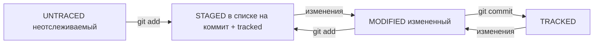

#Команды в Git Bash консоли
clear - Очистить консоль  

##Навигация
pwd - Показать текущий каталог  
ls - Показать файлы в данной папке, кроме скрытых  
ls -f - Показать файлы в данной папке, включая скрытые  
cd c:/ - Перейти в конкретный каталог  
cd - - Вернуться назад  
cd .. - Выйти на 1 уровень вверх  
cd../.. - Выйти на 2 уровня вверх  

##Создание каталогов
mkdir - Создать папку  
cd !$ - Перейти в только что созданную папку  
mkdir -p {app1,app2} - Создать сразу несколько папок  
mkdir -p app/{css,js} - Создать сразу несколько вложенных папок  

##Создание файлов
touch index.html - Создать файл index.html  
touch app/{css/main.css,js/main.js,index.html} - Создать сразу несколько файлов, никаких лишних пробелов быть не должно  

##Удаление файлов
rm test - Удалить пустую папку test  
rm -r test - Удалить папку с файлами внутри неё  

##Перемещение файлов
mv app1/*.* app2 - Переместить все файлы из папки app1 в папку app2  


# Шпаргалка markdown

## Выделение текста

Вы можете выделять текст в markdown с помощью символов `_` или `*`. Например:

Пример _курсива_ и **жирного** текста.

## Заголовки

Заголовки можно создавать с помощью символа `#`. Чем больше `#`, тем меньше заголовок. Например:

# Заголовок первого уровня
## Заголовок второго уровня
### Заголовок третьего уровня

## Выделение кода

Чтобы выделить текст как код, поместите его в тройные кавычки `````. 

```
mkdir my_project
cd my_project
git init
```
Это лишь некоторые функции markdown.

#Хеш — основной идентификатор коммита
Git хранит таблицу соответствий хеш → информация о коммите. Если вы знаете хеш, вы можете узнать всё остальное: автора и дату коммита и содержимое закоммиченных файлов. Можно сказать, что хеш — основной идентификатор коммита.
При работе с Git хеши будут встречаться вам регулярно. Их можно будет передавать в качестве параметра разным Git-командам, чтобы указать, с каким коммитом нужно произвести то или иное действие.
Все хеши и таблицу хеш → информация о коммите Git сохраняет в служебные файлы. Они находятся в скрытой папке .git в репозитории проекта.

Можно вызвать не только полный лог, но и сокращённый — это делается командой git log --oneline.
В сокращённом логе выводятся сокращённые хеши — их можно использовать точно так же, как и полные.

Файл HEAD (англ. «голова», «головной») — один из служебных файлов папки .git. Он указывает на коммит, который сделан последним (то есть на самый новый).
В числе прочих файлов в папке .git есть служебный файл HEAD. Он указывает на самый свежий коммит.
Вместо хеша последнего коммита можно написать слово HEAD — Git вас поймёт.

#Статусы файлов в Git



1. Файл только что создали. Git про него ещё ничего не знает. Состояние: untracked.
2. Файл добавили в staging area с помощью git add. Состояние: staged (+ tracked).
 - Возможно, изменили файл ещё раз. Состояния: staged, modified (+ tracked).
   Обратите внимание: staged и modified у одного файла, но у разных его версий.
 - Ещё раз выполнили git add. Состояние: staged (+ tracked).
3. Сделали коммит с помощью git commit. Состояние: tracked.
4. Изменили файл. Состояние: modified (+ tracked).
5. Снова добавили в staging area с помощью git add. Состояния: staged (+ tracked).
6. Сделали коммит. Состояния: tracked.
7. Повторили пункты 4−7 много-много раз.